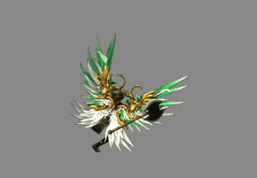
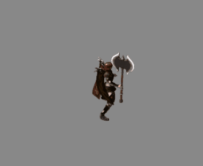
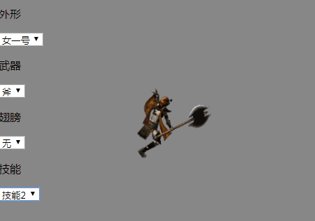

<!--more-->

### 一个简单的RPG角色动画



### 设计

骨骼动画：


序列帧动画：




文件名约定：

```
类型-ID-动作-方向
```

资源目录：

```
avatar
   |- roles
   |     |- player
   |     |     |- p-x-stand-0.png
   |     |     |- p-x-move-0.png
   |     |     |_ p-x-attack-0.png
   |     |_ npc
   |- weapon
   |     |- w-x-stand-0.png  
   |     |_ w-x-attack-0.png  
   |- wing
   |     |- wing-x-stand-0.png  
   |     |_ wing-x-attack-0.png  
   |- skill  
   |    |- skill-x-attack-0.png    
   |  
```

### 角色动画的制作

### 基于Egret的演示


