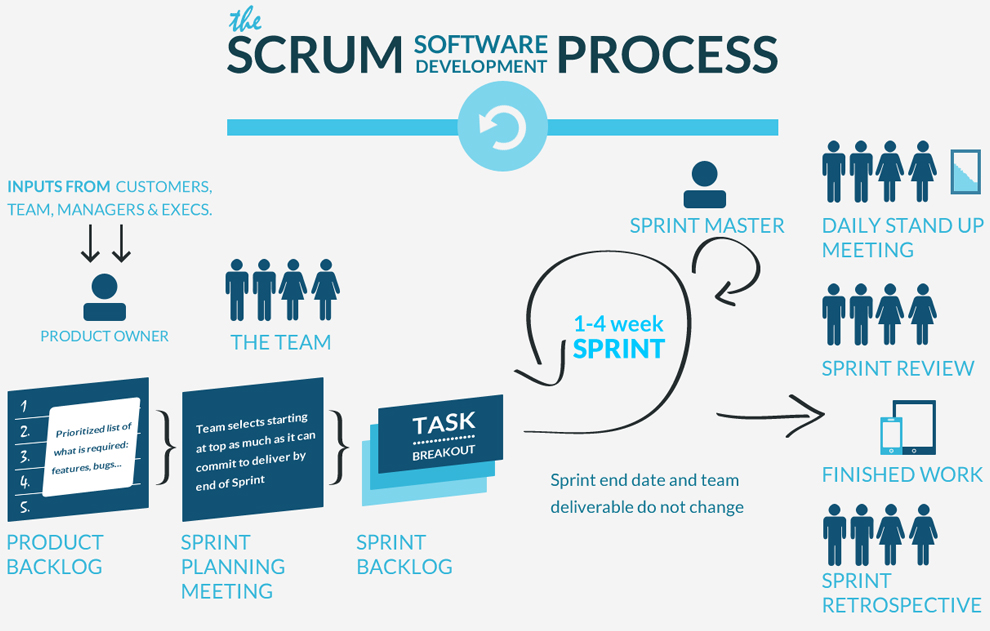
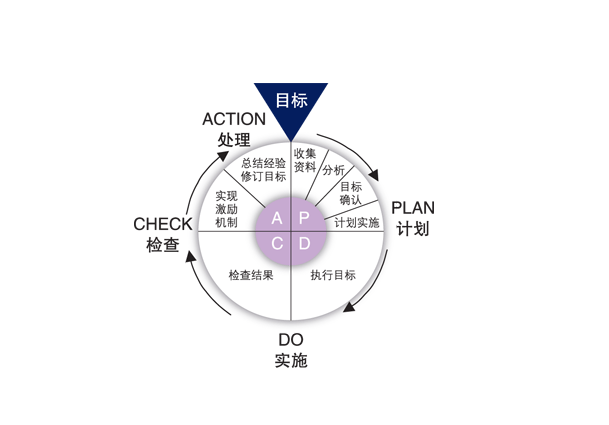
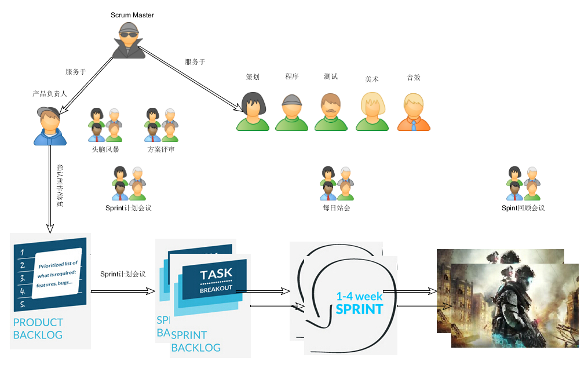

Scrum是一种敏捷开发的框架，对于任何软件开发甚至个人管理都非常具有指导意义。先放一张Scrum软件开发过程的框架图：

### 敏捷和Scrum

Scrum是一种敏捷实践，那敏捷又是什么呢？单纯的熬夜加班加点，快速地完成任务就叫敏捷吗？绝非如此，敏捷有着完整的软件开发流程，及其独到的思想，不只单纯的快，更讲究单位时间创造的价值，包含了很多实践，如：迭代计划，每日站会，协作的团队，极限编程，代码复审，持续集成，持续改进等等。

<!--more-->

回顾下敏捷开发的价值观：

- 个体和互动  高于 流程和工具
- 工作的软件  高于 详尽的文档
- 客户合作  高于 合同谈判
- 响应变化  高于 遵循计划

一定要注意“高于”二字，后面的也很重要，千万不要误解为不重要而忽视。关于敏捷和Scrum有很多经典的书都有描述，有需要可以Google。本文就按照自己的理解，意识流式随便写写。

游戏开发大大小小的团队都有，在开发过程中，有些时候流程会显的有些随意，有些混乱，很有必要借助Scrum框架来捋一捋，来优化下流程和日常的一些活动。**日常频率越高的活动，稍微改进一点，整个团队的效率就会有极大的提升。**

就以Scrum中的每日站会为例，大家站着围成一圈，依次回答下面三个问题：
 - 昨天完成了什么？
 - 今天要做什么，预期结果是怎样？
 - 遇到什么问题和障碍？

每日站会会是每个人每天开始工作的一个仪式，开完早会大家才能安心去干活，会议能减少1分钟，参会人越多省的时间就越多。每日站会是交流项目进度和遇到问题的绝佳时机，提出问题明确责任人即可，尽量不要尝试在站会上讨论和解决问题，会议时间应该限制在15分钟以内。

### Scrum游戏开发，如何进行？

要想实现目标，持续改进，做任何事情都可以参考戴明循环PDCA，不断进行迭代：

Scrum其实也遵循类似的逻辑，在每一次迭代开始，都要进行一次迭代计划会议，产品负责人会根据价值对需求进行排序，选择价值高的放入本次迭代的待办事项列表，每次迭代持续1-4周，通过每日站会驱动任务的执行，迭代结束时除了产品的增量及其评审外，还有一件重要的事情，就时反思此次迭代中存在的问题，比如：计划的内容为什么没开发完？通宵做的版本为什么总是要出问题？为什么总时在最后一刻需求有变化？等等。通过回顾和反思，改进Scrum流程，好的坚持，不好的改进。这样才是一个正向循环，经过一次一次的迭代，无论产品和流程都往着好的方向发展。

下面是2016整理的，Scrum游戏开发框架：

**产品负责人（Product Owner）**

- 清晰地表达产品待办列表项
- 对产品待办列表项进行排序，最好地实现目标和使命
- 优化开发团队所执行工作的价值
- 确保产品待办列表对所有人可见、透明、清晰，并且显示 Scrum 团队的下一步工作
- 确保开发团队对产品待办列表项有足够的理解
- 产品负责人负责最大化产品以及开发团队工作的价值。
- 由制作人、主策或专门的助理担任。
- 确认新功能的开发、BUG的修复。

**开发团队（Scum Team）**

- 策划：游戏设计、制作策划案、协调沟通。
- 程序：开发编码、联调测试。
- 测试：功能测试。
- 美术：制作美术资源。
- 音效：制作音效资源。
- 开发团队由组织组建并授权， 团队自己组织和管理他们的工作。
- 开发团队最佳规模是： 足够小以保持敏捷性，足够大以完成重要的工作。

** 流程管理员（Scrum Master）**

是Scrum特有的角色，服务于整个团队。

Scrum Master 服务于产品负责人：
- 找到有效管理产品待办列表的技巧
- 帮助 Scrum 团队理解“清晰准确的产品待办列表项”的重要性
- 在经验主义的环境中理解长期的产品规划
- 确保产品负责人懂得如何安排产品待办列表项来最大化价值
- 理解并实践敏捷
- 按要求或需要引导 Scrum 事件

Scrum Master 服务于开发团队：
- 在自组织和跨职能方面给予团队指导
- 协助开发团队开发高价值的产品
- 移除开发团队工作中的障碍
- 按要求或需要引导 Scrum 事件
- 在 Scrum 还未被完全采纳和理解的组织环境下指导开发团队

**头脑风暴**

- 游戏设计想法讨论
- 形成策划草案

**方案评审**
- 参与者：策划、程序、测试
- 评审策划方案
- 确定执行人员
- 确定执行用时
- 大家对讨论的主题都必须了解
- 策划方案尽可能详尽

**Sprint计划会议**
- 参与者：产品负责人、开发团队负责人
- 确定后续Sprint的开发内容
- 确定版本发布时间
- Sprint Backlog：可行无异议的待办列表
- Plan
- 新功能必须经过方案评审才能加入SprintBacklog

**每日站会**
- 参与者：团队所有成员　
- 昨天我为开发团队达成Sprint 目标做了什么
- 今天我准备如何帮助团队达成 Sprint目标
- 有什么事情阻碍了我帮助团队达成Sprint目标
- 整个团队规模比较小可以整体开会
- 规模较大需要进行拆分（特性团队、业务团队）
- 固定时间、<=15min
- 提出问题、会后找相关人员讨论

**产品待办列表（Product Backlog）**

- 产品待办列表是一个有序的列表，其中包含产品需要的一切可能的东西，也是产品需
求变动的唯一来源。
- 产品负责人负责管理产品待办列表的内容、可用性和排序。

**Sprint待办列表（Sprint Backlog）**

- Sprint 待办列表是一组为当前 Sprint 选出的产品待办列表项，外加交付产品增量和
实现 Sprint 目标的计划。

PS. 今天状态不太好，脑子有些转不动，但还是要坚持写些东西，回顾和整理过去的一些思考，逻辑有些混乱，大概看看，知道Scrum是游戏开发流程的一种很好的选择即可。系统学习，推荐几本书：

- 《敏捷软件开发：原则、模式于实践》 - Robert C·Martin
- 《Scrum敏捷软件开发》 - Mike Cohn
- 《Scrum敏捷游戏开发》 - Clinton Keith

敏捷并不简单，每一项实践都值得深思！
